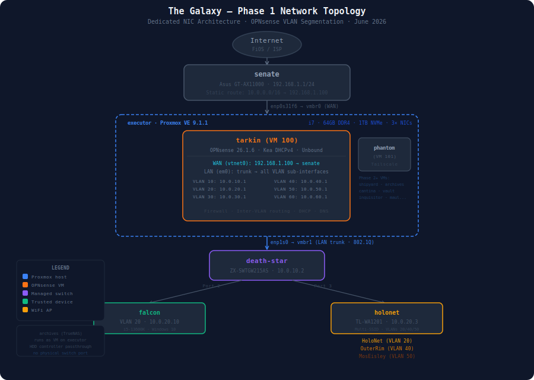
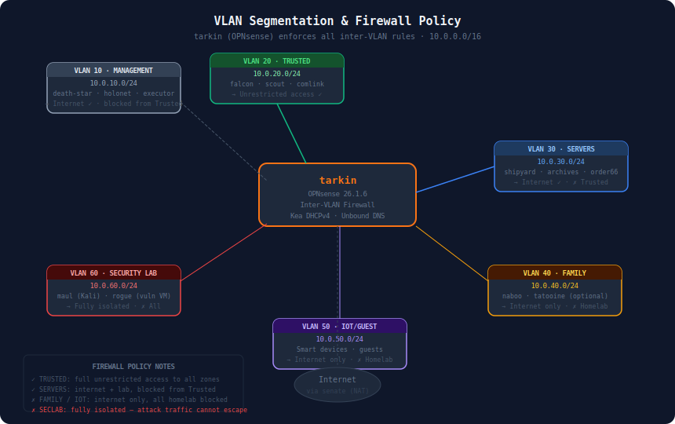

# The Galaxy — Network & Security Home Lab

A production-grade homelab built by a cybersecurity student (Marist University, class of
2027) to develop and demonstrate blue team skills: network defense, segmentation,
SIEM, log analysis, and vulnerability management.

> **AI-assisted workflow:** This project is built with Claude (Anthropic) as an AI pair
> programmer and documentation partner. Leveraging AI to accelerate learning, diagnose
> complex issues, and produce professional documentation is an intentional skill. All
> configurations are applied and verified on real hardware by the project owner.

---

## What This Is

A home network redesigned from a flat consumer setup into an enterprise-style segmented
architecture, documented end-to-end as a portfolio artifact. Every design decision has a
rationale. Every major issue encountered in the build is logged with root cause and fix.

The lab demonstrates practical skills directly applicable to security operations, network
engineering, and infrastructure roles — not theoretical knowledge, but working
configurations on real hardware.

---

## Architecture


### Network Topology

```
Internet → senate (Asus GT-AX11000, 192.168.1.1)
               │
               │ static route: 10.0.0.0/16 → 192.168.1.100
               │
           executor (Proxmox VE 9.1.1)
           ├── enp0s31f6 → vmbr0 (WAN, 192.168.1.225)
           └── enp1s0 → vmbr1 (LAN trunk, VLAN-aware)
                   │
               ┌───▼──────────┐
               │    tarkin     │  OPNsense 26.1.6
               │ WAN: .1.100  │  6 VLAN interfaces
               │ DHCP + DNS   │  Kea DHCPv4
               │ Firewall     │  802.1Q inter-VLAN routing
               └───┬──────────┘
                   │ VLAN trunk
               death-star (ZX-SWTGW215AS 2.5G managed switch)
               ├── Port 2: falcon (access, VLAN 20)
               └── Port 3: holonet (trunk, VLANs 20/40/50)
```

### VLAN Segmentation

| VLAN | Name | Subnet | Purpose | Internet | Homelab |
|------|------|--------|---------|----------|---------|
| 10 | Management | 10.0.10.0/24 | Network infrastructure | ✅ | Reachable from Trusted |
| 20 | Trusted | 10.0.20.0/24 | Personal devices | ✅ | Full access |
| 30 | Servers | 10.0.30.0/24 | VMs and NAS | ✅ | No access to Trusted |
| 40 | Family | 10.0.40.0/24 | Family devices | ✅ | Fully blocked |
| 50 | IoT/Guest | 10.0.50.0/24 | Smart devices, guests | ✅ | Fully blocked |
| 60 | Security Lab | 10.0.60.0/24 | Kali + vulnerable VMs | ✅ | Fully blocked |

### WiFi Networks

| SSID | VLAN | Purpose |
|------|------|---------|
| HoloNet | 20 (Trusted) | Personal devices |
| OuterRim | 40 (Family) | Family devices |
| MosEisley | 50 (IoT/Guest) | IoT, guests |

---

## Hardware

| Hostname | Role | Specs |
|----------|------|-------|
| executor | Proxmox hypervisor | i7 7700T, 64GB DDR4, 512GB NVMe, 2x512GB SSD, 12×4TB HDD (6 SATA + 6 SAS), GPU, 2× NICs |
| tarkin | OPNsense firewall (VM) | VM on executor |
| archives | TrueNAS SCALE (VM) | VM on executor, HDD controller passthrough |
| death-star | Core switch | ZX-SWTGW215AS, 8-port 2.5G managed |
| holonet | WiFi AP | TP-Link TL-WA1201, Multi-SSID mode |
| senate | House router | Asus GT-AX11000 (family network, not lab-managed) |
| falcon | Main workstation | i5-13600K, RTX 3060Ti, 32GB DDR5, Windows 10 |
| scout | Laptop | Linux Mint Cinnamon, ethernet + WiFi |
| comlink | Mobile | iPhone |

---

## VM Inventory

| VM ID | Hostname | OS | Role | VLAN | Status |
|-------|----------|----|------|------|--------|
| 100 | tarkin | OPNsense 26.1.6 | Firewall, DHCP, DNS | All | ✅ Running |
| 101 | phantom | Ubuntu (rebuild pending) | Tailscale exit node | 30 | ⬜ Not running |
| 102 | archives | TrueNAS SCALE | NAS (dual-controller passthrough) | 30 | ✅ Running |
| 103 | shipyard | Ubuntu Server 24.04 LTS | Docker, Portainer, Crafty | 30 | ✅ Running |
| 104 | order66 | — | Pi-hole DNS | 30 | Phase 3 |
| 105 | inquisitor | — | Wazuh SIEM | 30 | Phase 6 |
| 106 | cantina | — | Jellyfin | 30 | Phase 4 |
| 107 | vault | — | Nextcloud | 30 | Phase 5 |
| 108 | maul | Kali Linux | Pentesting | 60 | Phase 7 |
| 109 | rogue | — | Vulnerable VM | 60 | Phase 7 |

---

## Phases

| Phase | Focus | Status |
|-------|-------|--------|
| **1** | Core network — OPNsense, VLANs, managed switch, WiFi AP | ✅ Complete |
| **2** | Docker services (shipyard), Crafty/Minecraft, TrueNAS VM | ✅ Complete |
| **3** | Pi-hole DNS filtering + Tailscale remote access | ⬜ |
| **4** | Jellyfin media server with GPU transcoding | ⬜ |
| **5** | Nextcloud file server | ⬜ |
| **6** | Wazuh SIEM + dashboard displays | ⬜ |
| **7** | Security lab — Kali + vulnerable VM | ⬜ |
| **8** | AI tools + portfolio website | ⬜ |

---

## Skills Demonstrated

`Network segmentation` `VLAN design` `802.1Q trunking` `Firewall policy`
`OPNsense` `Proxmox VE` `Kea DHCPv4` `Unbound DNS` `Managed switch configuration`
`Static routing` `Asymmetric routing diagnosis` `Docker` `TrueNAS` `Wazuh SIEM`
`Pi-hole` `Tailscale` `Kali Linux` `AI-assisted engineering workflow`

---

## Repository Structure

```
thegalaxy/
├── README.md                    ← this file
├── network/
│   ├── diagrams/                ← SVG network diagrams
│   └── ip-scheme.md             ← VLAN table and static IP assignments
├── phases/
│   ├── phase-1-core-network.md  ← decisions, architecture, build log
│   └── phase-N-*.md
├── runbooks/                    ← step-by-step operational procedures
└── assets/                      ← screenshots, config exports
```
