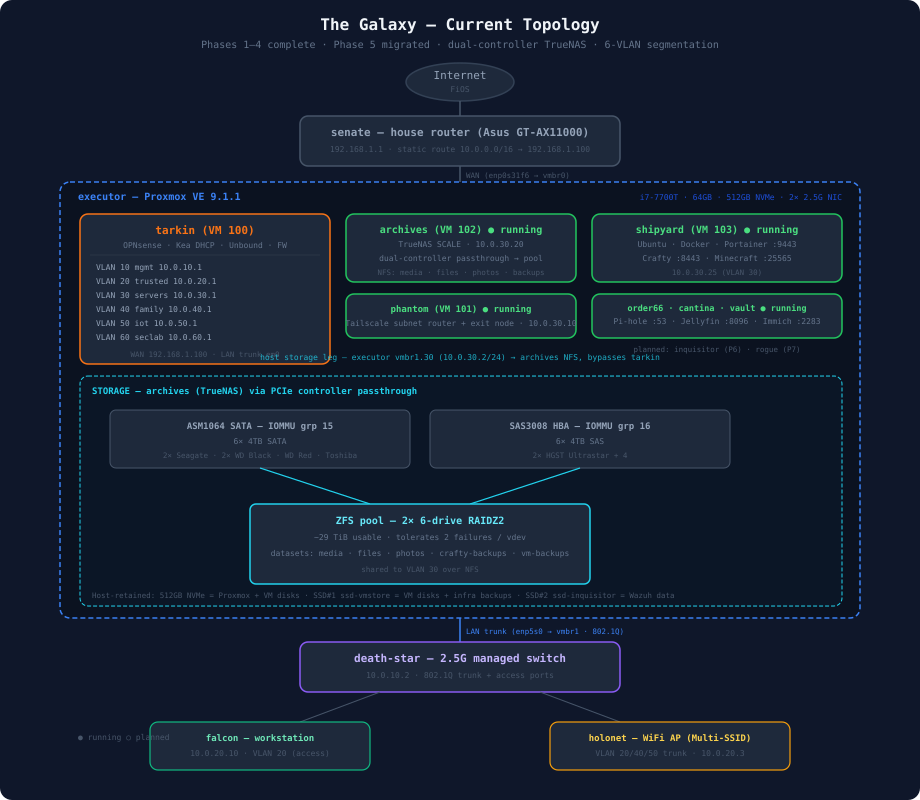
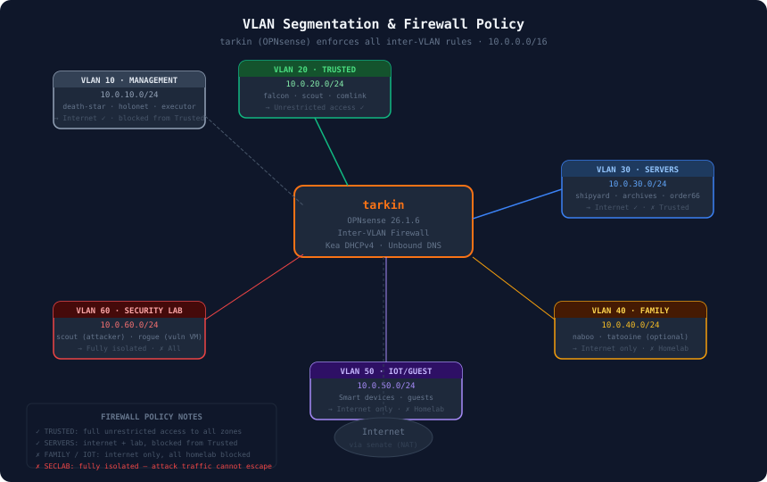

# The Galaxy — Network & Security Home Lab

An enterprise-style homelab built by a cybersecurity student (Marist University, class of
2027) to develop and demonstrate blue team skills: network defense, segmentation,
SIEM, log analysis, and vulnerability management.

> **AI-assisted workflow:** Built with Claude (Anthropic) as a pair programmer and
> documentation partner — a deliberate, modern engineering practice. I make the
> architecture decisions and do all hands-on configuration and verification on real
> hardware; AI accelerates research, sanity-checks designs, and produces documentation.
> The build logs preserve the reasoning, including faults I diagnosed independently —
> tracing four missing drives to a single unseated SAS breakout cable via serial-number
> analysis, and a lab-wide DNS outage to firewall rule ordering.

---

## What This Is

A home network redesigned from a flat consumer setup into an enterprise-style segmented
architecture, documented end-to-end as a portfolio artifact. Every design decision has a
rationale. Every major issue encountered in the build is logged with root cause and fix.

The lab demonstrates practical skills directly applicable to security operations, network
engineering, and infrastructure roles — not theoretical knowledge, but working
configurations on real hardware.

---

## Architecture


### Network Topology

```
Internet → senate (Asus GT-AX11000, 192.168.1.1)
               │
               │ static route: 10.0.0.0/16 → 192.168.1.100
               │
           executor (Proxmox VE 9.1.1)
           ├── enp0s31f6 → vmbr0 (WAN, 192.168.1.225)
           └── enp1s0 → vmbr1 (LAN trunk, VLAN-aware)
                   │
               ┌───▼──────────┐
               │    tarkin     │  OPNsense 26.1.6
               │ WAN: .1.100  │  6 VLAN interfaces
               │ DHCP + DNS   │  Kea DHCPv4
               │ Firewall     │  802.1Q inter-VLAN routing
               └───┬──────────┘
                   │ VLAN trunk
               death-star (ZX-SWTGW215AS 2.5G managed switch)
               ├── Port 2: falcon (access, VLAN 20)
               └── Port 3: holonet (trunk, VLANs 20/40/50)
```

### VLAN Segmentation

| VLAN | Name | Subnet | Purpose | Internet | Homelab |
|------|------|--------|---------|----------|---------|
| 10 | Management | 10.0.10.0/24 | Network infrastructure | ✅ | Reachable from Trusted |
| 20 | Trusted | 10.0.20.0/24 | Personal devices | ✅ | Full access |
| 30 | Servers | 10.0.30.0/24 | VMs and NAS | ✅ | No access to Trusted |
| 40 | Family | 10.0.40.0/24 | Family devices | ✅ | Fully blocked |
| 50 | IoT/Guest | 10.0.50.0/24 | Smart devices, guests | ✅ | Fully blocked |
| 60 | Security Lab | 10.0.60.0/24 | scout (attack laptop) + rogue (vulnerable VM) | ✅ | Fully blocked |

### WiFi Networks

| SSID | VLAN | Purpose |
|------|------|---------|
| HoloNet | 20 (Trusted) | Personal devices |
| OuterRim | 40 (Family) | Family devices |
| MosEisley | 50 (IoT/Guest) | IoT, guests |

---

## Hardware

| Hostname | Role | Specs |
|----------|------|-------|
| executor | Proxmox hypervisor | i7 7700T, 64GB DDR4, 512GB NVMe, 2x512GB SSD, 12×4TB HDD (6 SATA + 6 SAS), GPU, 2× NICs |
| tarkin | OPNsense firewall (VM) | VM on executor |
| archives | TrueNAS SCALE (VM) | VM on executor, HDD controller passthrough |
| death-star | Core switch | ZX-SWTGW215AS, 8-port 2.5G managed |
| holonet | WiFi AP | TP-Link TL-WA1201, Multi-SSID mode |
| senate | House router | Asus GT-AX11000 (family network, not lab-managed) |
| falcon | Main workstation | i5-13600K, RTX 3060Ti, 32GB DDR5, Windows 10 |
| scout | Laptop | Linux Mint Cinnamon, ethernet + WiFi |
| comlink | Mobile | iPhone |

---

## VM Inventory

| VM ID | Hostname | OS | Role | VLAN | Status |
|-------|----------|----|------|------|--------|
| 100 | tarkin | OPNsense 26.1.6 | Firewall, DHCP, DNS | All | ✅ Running |
| 101 | phantom | Ubuntu Server 24.04 LTS | Tailscale gateway — subnet router + exit node | 30 | ✅ Running |
| 102 | archives | TrueNAS SCALE | NAS (dual-controller passthrough) | 30 | ✅ Running |
| 103 | shipyard | Ubuntu Server 24.04 LTS | Docker, Portainer, Crafty | 30 | ✅ Running |
| 104 | order66 | Ubuntu Server 24.04 LTS | Pi-hole DNS | 30 | ✅ Running |
| 105 | inquisitor | — | Wazuh SIEM | 30 | Phase 6 |
| 106 | cantina | — | Jellyfin | 30 | Phase 4 |
| 107 | vault | — | Nextcloud | 30 | Phase 5 |
| 108 | rogue | — | Vulnerable VM (isolated, no internet) | 60 | Phase 7 |

---

## Design Goals & Threat Model
Built around four principles: contain blast radius, least privilege between zones,
visibility, and recoverability. Full write-up: [docs/threat-model.md](docs/threat-model.md).

## Phases

| Phase | Focus | Status |
|-------|-------|--------|
| **1** | Core network — OPNsense, VLANs, managed switch, WiFi AP | ✅ Complete |
| **2** | Docker services (shipyard), Crafty/Minecraft, TrueNAS VM | ✅ Complete |
| **3** | Pi-hole DNS filtering + Tailscale remote access | ✅ Complete\* |
| **4** | Jellyfin media server with GPU transcoding | ⬜ |
| **5** | Nextcloud file server | ⬜ |
| **6** | Wazuh SIEM + dashboard displays | ⬜ |
| **7** | Security lab — scout (attack laptop) + rogue (isolated vulnerable VM) | ⬜ |
| **8** | AI tools + portfolio website | ⬜ |

\* Offsite appliance pending hardware — tracked in
[phases/phase-3-dns-and-tailscale.md](phases/phase-3-dns-and-tailscale.md).

---

## Skills by Phase
| Phase | Skills |
|---|---|
| 1 | VLAN design · 802.1Q trunking · OPNsense · Kea DHCP · static routing · asymmetric-routing diagnosis · managed switch config |
| 2 | Proxmox VE · Docker · TrueNAS/ZFS · PCIe controller passthrough · IOMMU isolation · RAIDZ2 · NFS |
| 3 | Pi-hole · recursive Unbound · Tailscale · firewall policy · 3-2-1 backup |
| 4 | GPU passthrough · Jellyfin hardware transcode |
| 5 | Nextcloud · self-hosted file services |
| 6 | Wazuh SIEM · log-pipeline design · detection engineering · dashboards |
| 7 | Attack/defend range · vulnerability management · network isolation |
| 8 | Cloudflare Tunnel · DMZ design · automation/scripting |
---

## Repository Structure

thegalaxy/
├── README.md
├── CLAUDE.md        ← rules for AI-assisted work in this repo
├── .claude/skills/  ← repo-audit skill
├── docs/            ← hardware-inventory, backup-strategy, telemetry-logging, threat-model
├── decisions/       ← ADRs (numbered, immutable)
├── network/         ← ip-scheme, firewall-rules, dns-design, diagrams/
├── phases/          ← per-phase build logs
├── runbooks/        ← operational procedures
├── config-backups/  ← (local only — see note; not pushed publicly)
└── assets/

## Documentation
- [docs/](docs/) — hardware inventory, backup strategy, telemetry/logging, threat model
- [decisions/](decisions/) — architecture decision records (ADRs)
- [network/](network/) — IP scheme, firewall rules, DNS design, diagrams
- [runbooks/](runbooks/) — operational procedures
- [phases/](phases/) — per-phase build logs